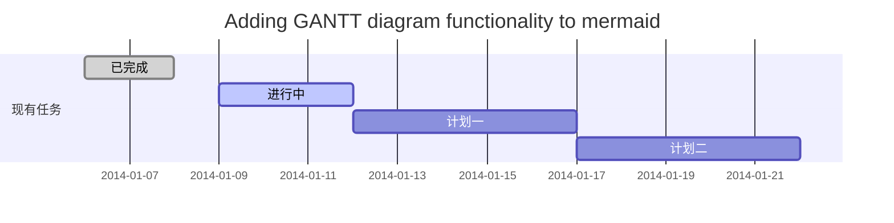
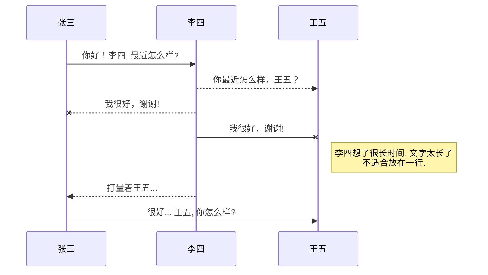
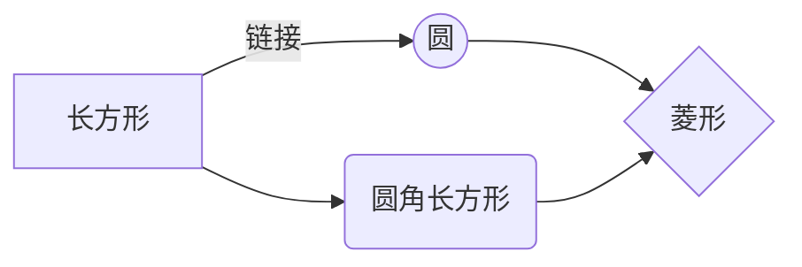

# 安装环境
本文使用的系统环境为：centos7
Hexo涉及需要安装的环境如下：Node.js、Hexo、git

## 安装 Node.js
 1. 首先安装wget  (如果已经安装了可以跳过该步) ：
	```bash
	yum install -y wget
	```

 2. 下载nodejs最新的bin包：<br/>可以在下载页面[https://nodejs.org/en/download/](https://nodejs.org/en/download/)中找到需要的版本的下载地址。然后执行指令
	```bash
	wget https://nodejs.org/dist/v12.13.0/node-v12.13.0-linux-x64.tar.xz
	```

 3. 解压包，依次执行：
	```bash
	xz -d node-v12.13.0-linux-x64.tar.xz
	tar -xf  node-v12.13.0-linux-x64.tar
	```

 
 4. 部署bin文件：<br/>先确认你nodejs的路径，我这里的路径为 ~/node-v12.13.0-linux-x64/bin。确认后依次执行。注意ln指令用于创建关联（类似与Windows的快捷方式）必须给全路径，否则可能关联错误。<p>
	```bash
	ln -s ~/node-v12.13.0-linux-x64/bin/node /usr/bin/node
	ln -s ~/node-v12.13.0-linux-x64/bin/npm /usr/bin/npm
	ln -s ~/node-v12.13.0-linux-x64/bin/npm /usr/bin/npx
	```

 5. 测试：<br/>```node -v```<br/>```npm```<p>

## 安装 Hexo

 1. 接下来就需要安装 Hexo 了，这是一个博客框架，Hexo 官方还提供了一个命令行工具，用于快速创建项目、页面、编译、部署 Hexo 博客，所以在这之前我们需要先安装 Hexo 的命令行工具。命令如下：
	```bash
	npm install -g hexo-cli
	```

 
 2. 输入以下命令测试是否安装成功<br/>```hexo```<br/>

# 初始化项目
接下来我们使用 Hexo 的命令行创建一个项目，并将其在本地跑起来，整体跑通看看。
## 初始化并启动项目

 1. 在 /usr/local 目录下创建项目：keep为项目名称 。这样在keep文件夹下就会出现Hexo的初始化文件
	```bash
	cd /usr/local
	hexo init keep
	```
 
 2. 进入keep文件夹，执行下面命令，生成HTML代码：
可以看到，在keep文件夹下生成了public文件夹，里面包含有 js、css、font 等内容
	```bash
	hexo generate
	```

 3. 启动Hexo：<p>```hexo serve```

 4. 访问上图红框的链接，如果不是在本机，则将localhost换成ip地址

 5. 这里存在一个问题，通过以上方式（```hexo serve```）启动后，如果此时ssh断开、或者ctrl + c退出了，那么hexo进程也会退出。那么通过以下方式解决该问题：pm2来管理hexo进程

## pm2管理hexo进程

 1. 在博客根目录下创建 hexo_run.js 文件
	```bash
	touch hexo_run.js
	```

 
 2. 添加以下内容 
	```javascript
		const { exec } = require('child_process')
		exec('hexo server',(error, stdout, stderr) => {
		        if(error){
	                console.log('exec error: ${error}')
	                return
		        }
		        console.log('stdout: ${stdout}');
		        console.log('stderr: ${stderr}');
		})
	```

 3. 安装pm2
	```powershell
	npm install -g pm2
	```
	
 4. 启动博客
	```powershell
	pm2 start hexo_run
	```
	
	

 5. 关闭
	```powershell
	pm2 stop hexo_run
	```

	

 6. 重启
	```powershell
	pm2 restart hexo_run
	```

# 部署
接下来我们来将这个初始化的博客进行一下部署，放到 GitHub Pages 上面验证一下其可用性。成功之后我们可以再进行后续的修改，比如修改主题、修改页面配置等等。Hexo 已经给我们提供一个命令，利用它我们可以直接将博客一键部署，不需要手动去配置服务器或进行其他的各项配置。

 1. 打开根目录下的 _config.yml 文件，找到 Deployment 这个地方，把刚才新建的 Repository 的地址贴过来，然后指定分支为 master 分支，最终修改为如下内容：
	```yaml
	# Deployment
	## Docs: https://hexo.io/docs/deployment.html
	deploy:
	  type: git
	  repo: git@github.com:zoujin001/keep.github.io.git
	  branch: master
	```
	注意：我这里git地址使用的是ssh方式，如果使用的是https方式的，请切换为ssh方式，点击 “**Use SSH**” 即可
	


 2. 安装Git插件
	```bash
	npm install hexo-deployer-git --save
	```
	如果不安装会报如下错误：
	```bash
	Deployer not found: git
	```
 3. 配置站点访问地址：编辑项目根目录下的 _config.yml 文件，找到 # URL 开始的这段，根据你的Github地址配置
	```yaml
	# URL
	## If your site is put in a subdirectory, set url as 'http://yoursite.com/child' and root as '/child/'
	url: https://github.com/zoujin001/keep.github.io
	root: /keep.github.io/
	permalink: :year/:month/:day/:title/
	permalink_defaults:
	pretty_urls:
	  trailing_index: true # Set to false to remove trailing index.html from permalinks
	```
	说明：url：Github仓库地址
	
			  <br/>
			   root：Github项目访问地址，这里配上仓库名称就行了<br/>		   
	<br/>
 4. 在项目根目录下执行部署命令
	```bash
	hexo deploy
	```
	注意：如果这里部署不上去的，请在机器上生成SSH密钥，然后配置在Github上。具体操作参考链接：[Github配置ssh key](https://blog.csdn.net/u013778905/article/details/83501204)
 
 5. 登录Github，进入对应仓库->点击Settings->GitHub Pages，下图标红的就是博客的访问地址


图片: 

带尺寸的图片: 

居中的图片: 

居中并且带尺寸的图片: 

当然，我们为了让用户更加便捷，我们增加了图片拖拽功能。

## 如何插入一段漂亮的代码片

去[博客设置](https://mp.csdn.net/configure)页面，选择一款你喜欢的代码片高亮样式，下面展示同样高亮的 `代码片`.
```javascript
// An highlighted block
var foo = 'bar';
```

## 生成一个适合你的列表

- 项目
  - 项目
    - 项目

1. 项目1
2. 项目2
3. 项目3

- [x] 计划任务
- [x] 完成任务

## 创建一个表格
一个简单的表格是这么创建的：
项目     | Value
-------- | -----
电脑  | $1600
手机  | $12
导管  | $1

### 设定内容居中、居左、居右
使用`:---------:`居中
使用`:----------`居左
使用`----------:`居右
| 第一列       | 第二列         | 第三列        |
|:-----------:| -------------:|:-------------|
| 第一列文本居中 | 第二列文本居右  | 第三列文本居左 | 

### SmartyPants
SmartyPants将ASCII标点字符转换为“智能”印刷标点HTML实体。例如：
|    TYPE   |ASCII                          |HTML                         
|----------------|-------------------------------|-----------------------------|
|Single backticks|`'Isn't this fun?'`            |'Isn't this fun?'            |
|Quotes          |`"Isn't this fun?"`            |"Isn't this fun?"            |
|Dashes          |`-- is en-dash, --- is em-dash`|-- is en-dash, --- is em-dash|

## 创建一个自定义列表
Markdown
:  Text-to-HTML conversion tool

Authors
:  John
:  Luke

## 如何创建一个注脚

一个具有注脚的文本。[^2]

[^2]: 注脚的解释

##  注释也是必不可少的

Markdown将文本转换为 HTML。

*[HTML]:   超文本标记语言

## KaTeX数学公式

您可以使用渲染LaTeX数学表达式 [KaTeX](https://khan.github.io/KaTeX/):

Gamma公式展示 $\Gamma(n) = (n-1)!\quad\forall
n\in\mathbb N$ 是通过欧拉积分

$$
\Gamma(z) = \int_0^\infty t^{z-1}e^{-t}dt\,.
$$

> 你可以找到更多关于的信息 **LaTeX** 数学表达式[here][1].

## 新的甘特图功能，丰富你的文章


- 关于 **甘特图** 语法，参考 [这儿][2],

## UML 图表

可以使用UML图表进行渲染。 [Mermaid](https://mermaidjs.github.io/). 例如下面产生的一个序列图：



这将产生一个流程图。:



- 关于 **Mermaid** 语法，参考 [这儿][3],

## FLowchart流程图

我们依旧会支持flowchart的流程图：
```mermaid
flowchat
st=>start: 开始
e=>end: 结束
op=>operation: 我的操作
cond=>condition: 确认？

st->op->cond
cond(yes)->e
cond(no)->op
```

- 关于 **Flowchart流程图** 语法，参考 [这儿][4].

## 导出与导入

###  导出
如果你想尝试使用此编辑器, 你可以在此篇文章任意编辑。当你完成了一篇文章的写作, 在上方工具栏找到 **文章导出** ，生成一个.md文件或者.html文件进行本地保存。

### 导入
如果你想加载一篇你写过的.md文件，在上方工具栏可以选择导入功能进行对应扩展名的文件导入，
继续你的创作。

 [1]: http://meta.math.stackexchange.com/questions/5020/mathjax-basic-tutorial-and-quick-reference
 [2]: https://mermaidjs.github.io/
 [3]: https://mermaidjs.github.io/
 [4]: http://adrai.github.io/flowchart.js/